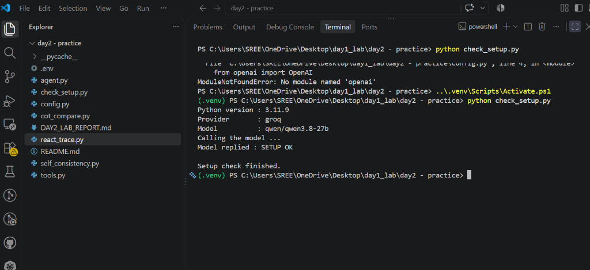
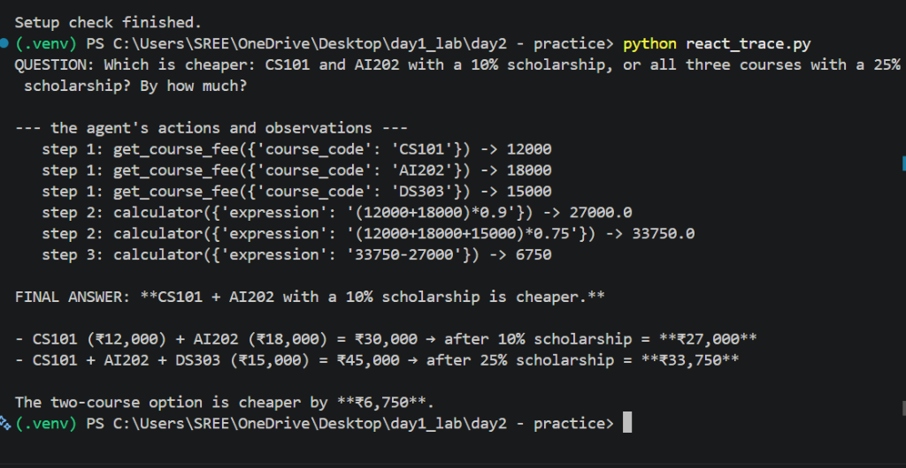
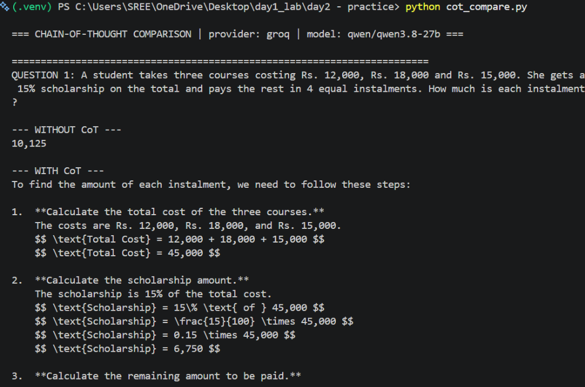
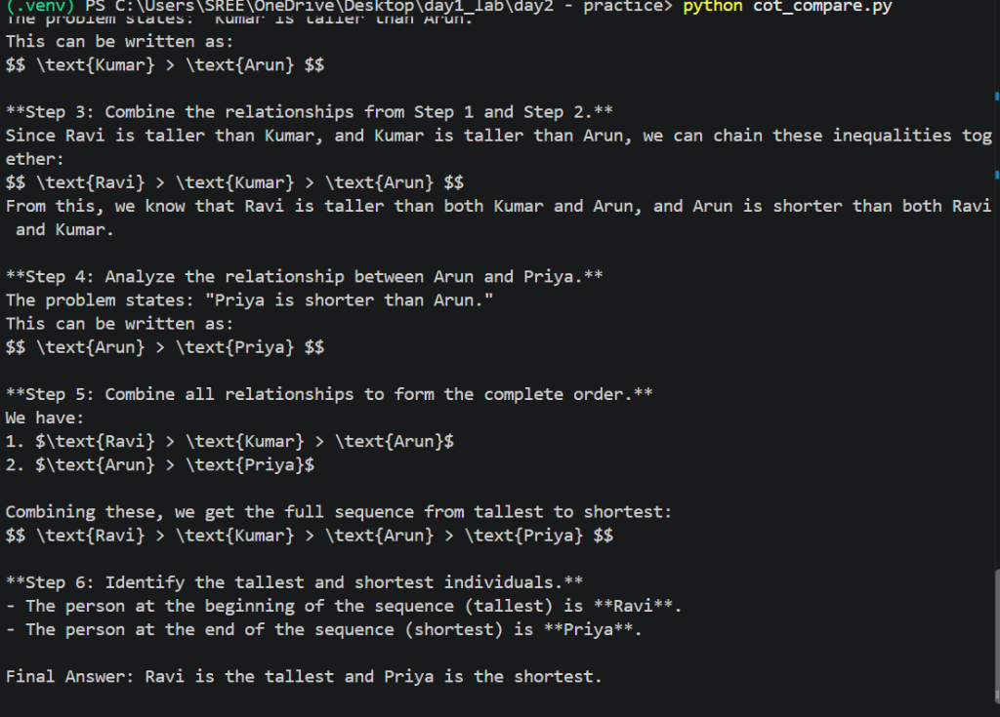
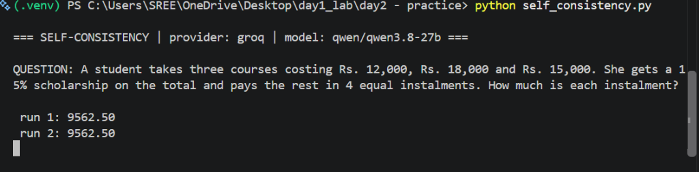

# Day 2 Lab: Tracing ReAct on Paper, and Comparing Answers With and Without Chain-of-Thought

**Course:** Agentic AI: Foundations and Open-Source Practice  
**Unit:** Unit 1 — Foundations of AI Agents (Sub-topics 1.3 and 1.4)  
**Workspace:** Day 2 Practice  

---

## 1. Overview

This directory contains the complete implementation, experiment scripts, execution screenshots, and evaluation outputs for Day 2 of the Agentic AI series. The lab explores:
1. **ReAct Tracing**: Tracing the Thought-Action-Observation cycle on paper vs. running a real agent to analyze parallel tool invocation.
2. **Chain-of-Thought (CoT)**: Comparing Direct Prompting against CoT Prompting across multi-step arithmetic, counting, and logical ordering tasks.
3. **Self-Consistency**: Sampling multiple reasoning trajectories at non-zero temperature ($T=0.8$) and applying majority voting on final answers.

---

## 2. Directory Structure

```
day2 - practice/
├── .env                  # Environment variables & Groq API configuration
├── config.py             # Shared settings, model configuration & course fee data
├── tools.py              # Tool definitions (get_course_fee, safe calculator AST)
├── agent.py              # System 3 ReAct agent runtime
├── check_setup.py        # API connection test script
├── react_trace.py        # Part B: Tracing real agent tool calls and execution order
├── cot_compare.py        # Part C: Comparing Direct vs. Chain-of-Thought prompting
├── self_consistency.py   # Part D: Running CoT 5 times and majority voting
├── screenshots/          # VS Code terminal output screenshots
│   ├── 01_check_setup.png
│   ├── 02_react_trace.png
│   ├── 03_cot_compare_q1.png
│   ├── 04_cot_compare_q3.png
│   └── 05_self_consistency.png
├── DAY2_LAB_REPORT.md    # Comprehensive lab report with screenshots & Q&A
└── README.md             # Lab documentation (this file)
```

---

## 3. Setup & Environment

### Prerequisites
- Python 3.11+
- Virtual environment (`.venv`) with `openai` and `python-dotenv` installed
- Valid Groq API Key set in `.env` (`MODEL=qwen/qwen3.8-27b`)

### Setup Verification
Run the setup check script:
```bash
python check_setup.py
```


---

## 4. Running the Day 2 Scripts

### 1. Real ReAct Trace Execution
```bash
python react_trace.py
```


---

### 2. Direct Prompting vs. Chain-of-Thought Comparison
```bash
python cot_compare.py
```



---

### 3. Self-Consistency Majority Voting
```bash
python self_consistency.py
```


---

## 5. Summary of Findings

| Technique | Data Access | Reasoning | Key Benefit | Main Limitation |
| :--- | :--- | :--- | :--- | :--- |
| **Direct Prompting** | Parametric | Single-step output | Fast, low latency | Fails multi-step math/logic |
| **Chain-of-Thought (CoT)** | Parametric | Intermediate steps | High accuracy on math/logic | Hallucinates private data |
| **Self-Consistency** | Parametric | Sampled paths + voting | Eliminates decoding variance | 5x token cost & latency |
| **ReAct Agent** | Dynamic Tools | Reason + Act cycle | Grounded in external facts | Depends on model tool-calling |

For full experimental tables, paper trace comparisons, discussion answers, and viva preparation, see **[DAY2_LAB_REPORT.md](file:///c:/Users/SREE/OneDrive/Desktop/day1_lab/day2%20-%20practice/DAY2_LAB_REPORT.md)**.
